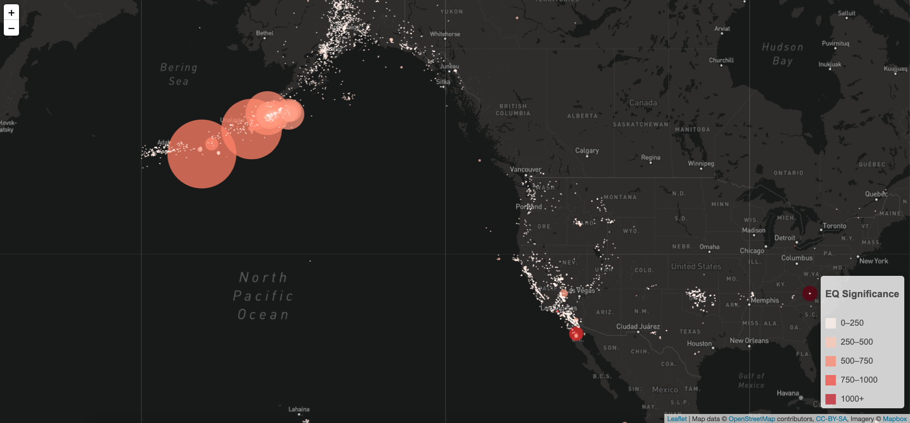
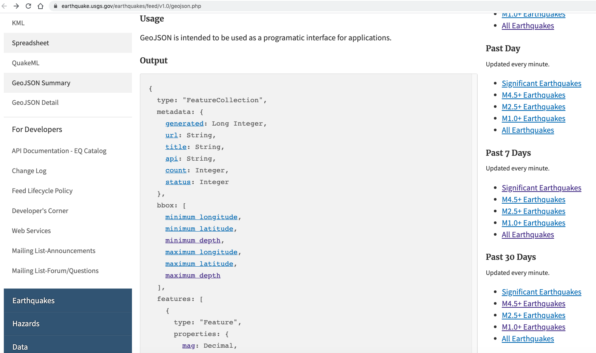
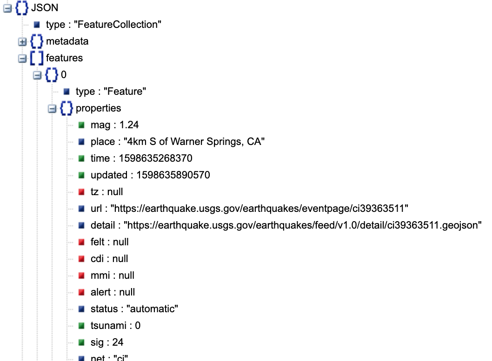
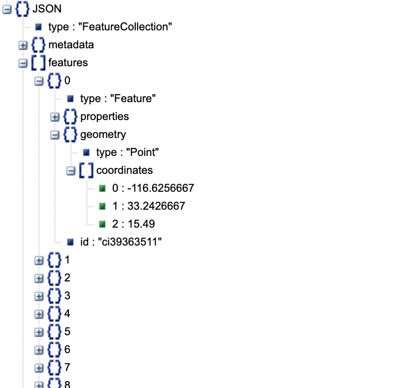
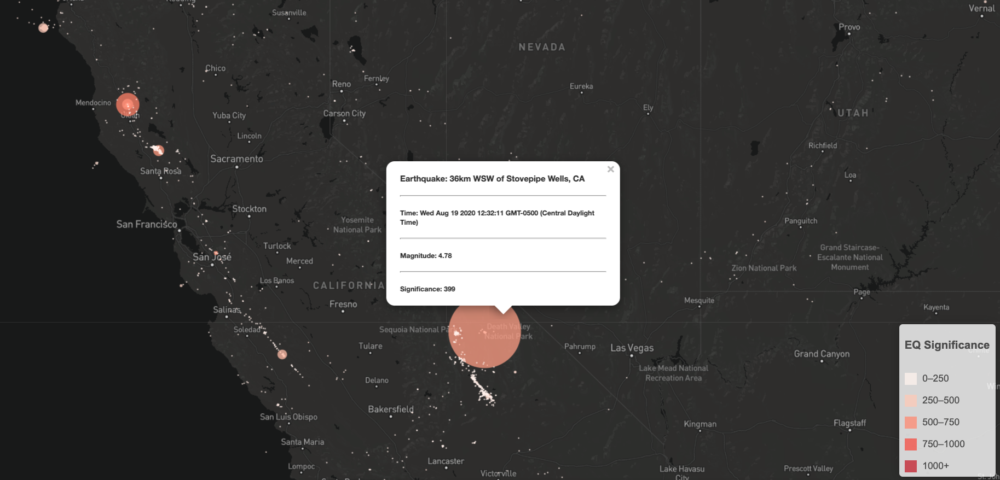
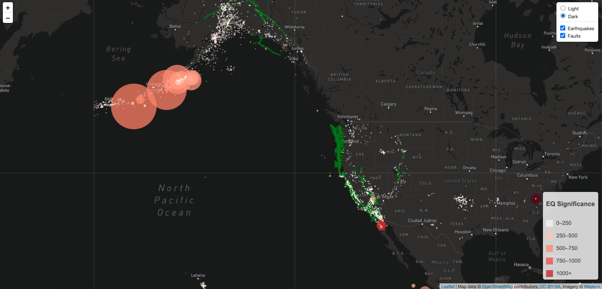
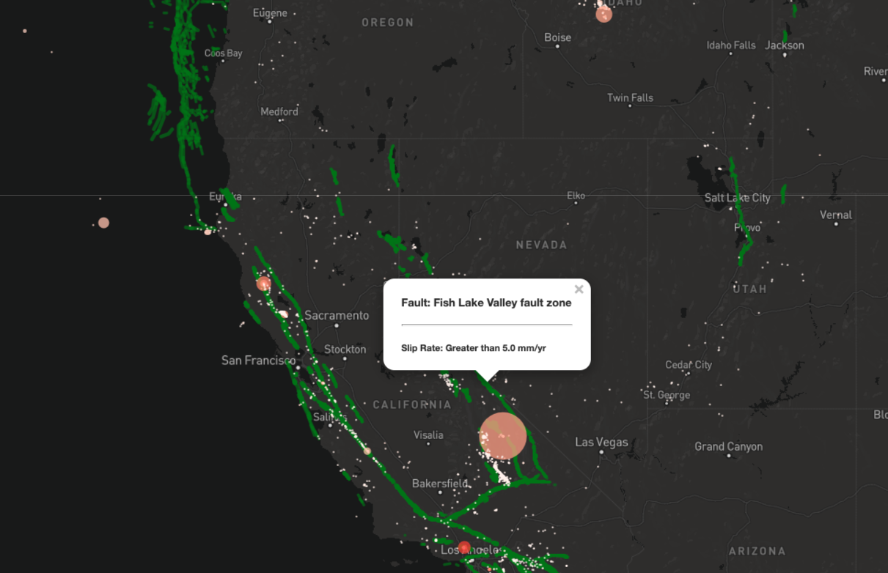

# Leaflet Homework - Visualizing Data with Leaflet

## Background

Welcome to the United States Geological Survey, or USGS for short! The USGS is responsible for providing scientific data about natural hazards, the health of our ecosystems and environment; and the impacts of climate and land-use change. Their scientists develop new methods and tools to supply timely, relevant, and useful information about the Earth and its processes. As a new hire, you will be helping them out with an exciting new project!

The USGS is interested in building a new set of tools that will allow them visualize their earthquake data. They collect a massive amount of data from all over the world each day, but they lack a meaningful way of displaying it. Their hope is that being able to visualize their data will allow them to better educate the public and other government organizations (and hopefully secure more funding..) on issues facing our planet.

### Before You Begin

1. Create a new repository for this project called `leaflet-challenge`. **Do not add this homework to an existing repository**.

2. Clone the new repository to your computer.

3. Inside your local git repository, create a directory for the Leaflet challenge. Use the folder names to correspond to the challenges: **Leaflet-Step-1** and **Leaflet-Step-2**.

4. This homeworks utilizes both **html** and **Javascript** so be sure to add all the necessary files. These will be the main files to run for analysis.

5. Push the above changes to GitHub or GitLab.

## Your Task

### Level 1: Basic Visualization

Your first task is to visualize an earthquake data set.

1. **Get your data set**

   

   The USGS provides earthquake data in a number of different formats, updated every 5 minutes. 
   Use the following dataset to plot earthquakes on your map,
   [Past 30 Days M1.0+ Earthquakes](https://earthquake.usgs.gov/earthquakes/feed/v1.0/summary/1.0_month.geojson)

   You can visit the [USGS GeoJSON Feed](http://earthquake.usgs.gov/earthquakes/feed/v1.0/geojson.php) page and study the important fields in the geoJSON under the `Output` section,
   (You will need to study the fields `mag`, `sig` and `time` under the keys features -> properties) 

   

   

2. **Import & Visualize the Data**

   Create a map using Leaflet that plots all of the earthquakes from your data set based on their longitude and latitude.

   * Your data markers should reflect the magnitude of the earthquake in their size and and the significance of earthquake in their color. Earthquakes with higher magnitudes should appear larger and those with higher significance should appear darker in color.

   * Include popups that provide additional information about the earthquake when a marker is clicked.

   

   * Create a legend that will provide context for your map data as shown in the map above. 
   [This assignment only requires you to do a color (Significance) legend]

   * Your visualization should look something like the map above.

- - -

### Level 2: More Data (Optional)

The USGS wants you to plot a second data set on your map to illustrate the relationship between earthquakes and fault-lines. You will need to pull in a second data set and visualize it along side your original set of data. [Fault data](static/data/qfaults_latest_quaternary.geojson) has already been provided in the static/data folder.

In this step we are going to..

* Plot a second data set on our map.

* Only plot the fault-lines which have the following slip_rate values,
`Greater than 5.0 mm/yr` and `Between 1.0 and 5.0 mm/yr`

* Use a higher stroke-weight for fault-lines with higher slip_rate

* Add a number of base maps to choose from as well as separate out our two different data sets into overlays that can be turned on and off independently.

* Add layer controls to our map as shown in map above.

* Include popups that provide additional information about the fault when a fault-line is clicked.

   

- - -

### Assessment

Your final product will be assessed on the following metrics:

* Completion of assigned tasks

* Visual appearance

* Professionalism

* **Ensure your repository has regular commits (i.e. 10+ commits) and a thorough README.md file**

**Good luck!**

### Copyright

Trilogy Education Services © 2019. All Rights Reserved.
